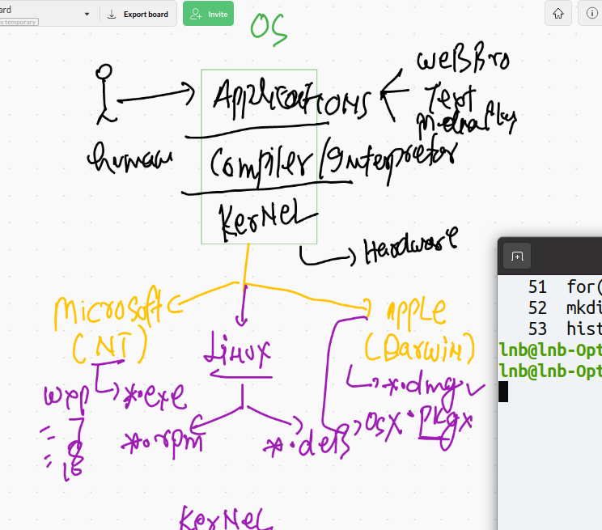
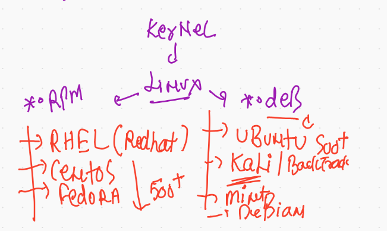
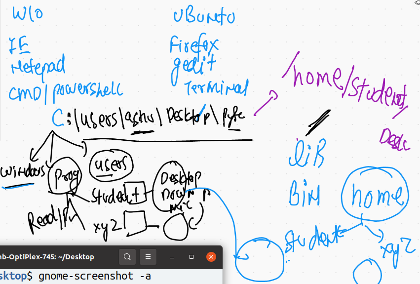

# lnb_session_trail

## General info 



## os Kernel info 


##  Windows and linux directory structure compare 




###  command history 


```
36  gedit
   37  cd  /
   38  ls
   39  cd  C:
   40  cd
   41  whoami
   42  cd  /home/lnb
   43  ls
   44  cd  /home/lnb/Desktop
   45  ls
   46  mkdir hello
   47  ls
   48  mkdir  a  b c d e 
   49  rmdir  a  b c d e 
   50  for((i=1;i<20;i++)); do mkdir lnbb$i; done
   51  for((i=1;i<20;i++)); do rmdir lnbb$i; done
   52  mkdir  ok{1..20}
   53  history 
   54  gnome-screenshot -a

```
